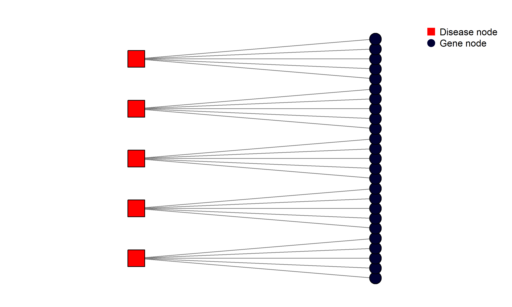
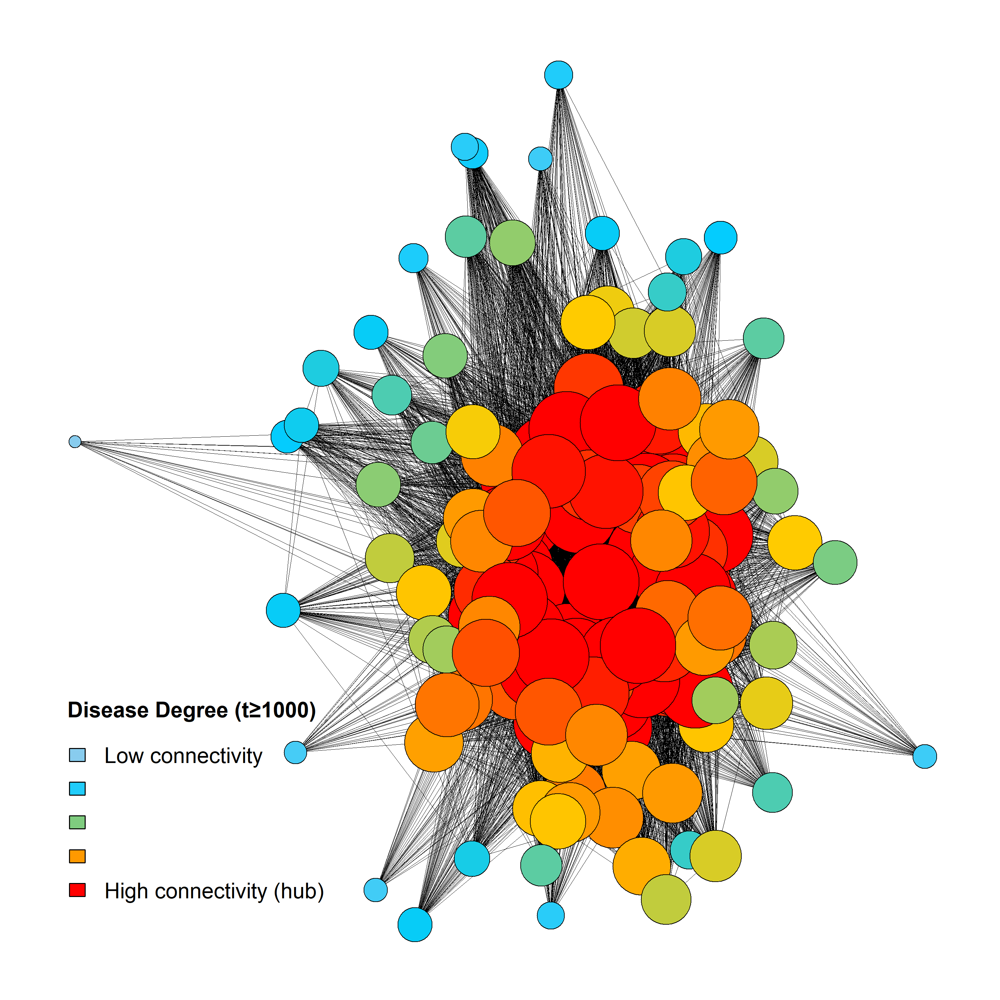
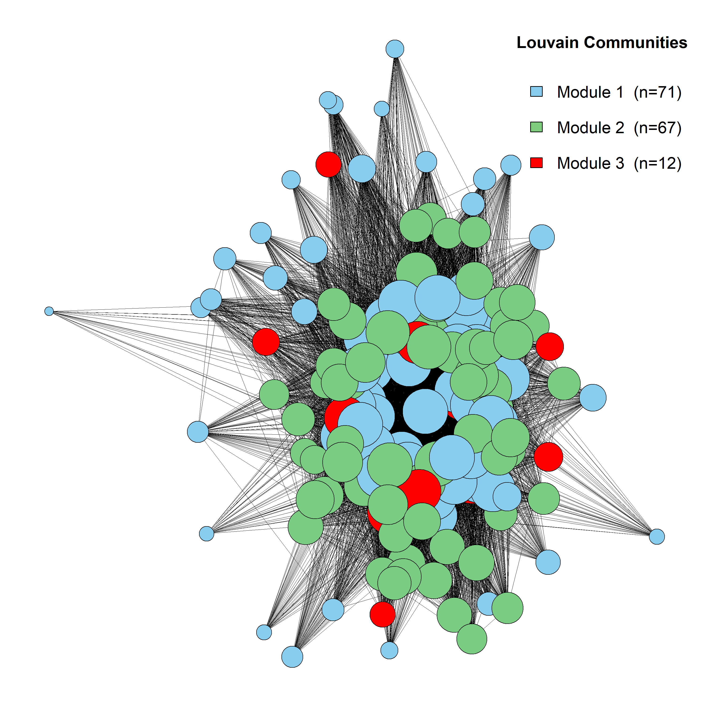
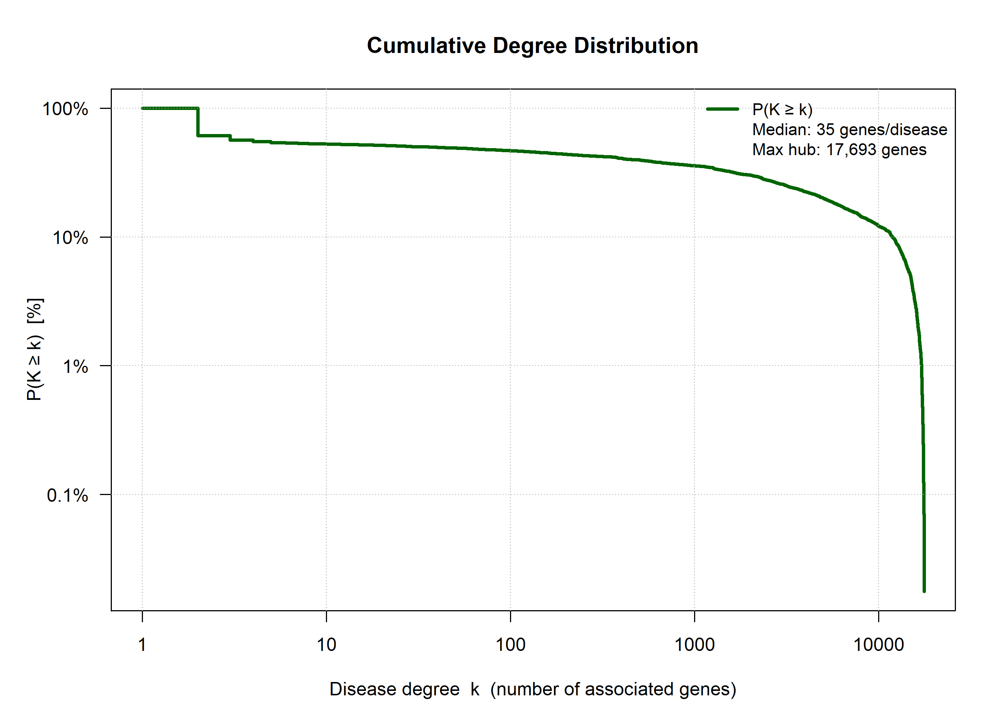
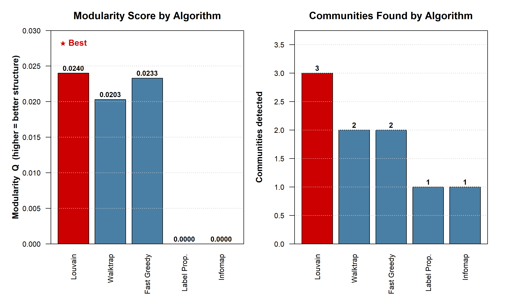

# The Human Diseasome: Community Detection in Disease-Gene Networks

Network analysis of the human "diseasome," a graph linking diseases that share
associated genes. Built as part of MS6032 Networks and Complex Systems at the
University of Limerick.

## What this does

Diseases don't exist in isolation. Many share the same underlying genes, a
phenomenon called pleiotropy. This project turns that shared-gene structure
into a network and asks two questions: which diseases cluster together, and
which community detection algorithm finds that structure best.

The pipeline:

1. **Load and filter** a disease-gene association dataset (DG-Miner), removing
   genes that appear only once since they carry no structural information for
   projection.
2. **Project to a disease-disease network** using sparse matrix multiplication
   (`P = B^T * B`), where two diseases are connected if they share associated
   genes, weighted by how many genes they share.
3. **Build two networks**: a full network at a conservative threshold for
   honest summary statistics, and a stratified subgraph (hubs, mid-degree,
   and peripheral nodes sampled proportionally) for visualisation, since
   plotting the full network is unreadable.
4. **Compare five community detection algorithms** on the same subgraph:
   Louvain, Walktrap, Fast Greedy, Label Propagation, and Infomap, scored by
   modularity (Q).
5. **Visualise**: bipartite disease-gene structure, a degree-weighted
   "pleiotropy" heat map, the winning community partition, the cumulative
   degree distribution, and a side-by-side algorithm comparison.

## Results

- Diseases have a median of **35 associated genes**; the most pleiotropic
  disease hub is linked to **17,693 genes**, showing the classic heavy-tailed
  degree distribution seen in most real-world networks.
- **Louvain performed best** (Q = 0.0240), narrowly ahead of Fast Greedy
  (Q = 0.0233) and Walktrap (Q = 0.0203). Label Propagation and Infomap both
  collapsed to a single community (Q = 0.0000) on this subgraph, illustrating
  how sensitive some algorithms are to sparse, low-modularity structure.
- Louvain split the sampled network into **3 communities** (sizes 71, 67, and
  12 nodes), against 2 for Walktrap/Fast Greedy and 1 for the other two.

| Algorithm | Modularity (Q) | Communities found |
|---|---|---|
| **Louvain** | **0.0240** | 3 |
| Fast Greedy | 0.0233 | 2 |
| Walktrap | 0.0203 | 2 |
| Label Propagation | 0.0000 | 1 |
| Infomap | 0.0000 | 1 |

## Visualisations

**Bipartite disease-gene structure** (sample):



**Pleiotropy heat map** — node colour and size scale with gene-sharing degree:



**Louvain community partition** — the winning algorithm's structure:



**Cumulative degree distribution** — the long tail of highly pleiotropic diseases:



**Algorithm comparison** — modularity and community count side by side:



## Tech stack

R, `igraph` (network construction, layout, community detection algorithms),
`data.table` (fast filtering/aggregation on the raw association table),
`Matrix` (sparse matrix projection for memory efficiency on a large edge list).

## Data

Uses the **DG-Miner disease-gene association dataset**. The raw file isn't
included here; to reproduce, download it and point the `file_path` variable
in `Main.R` to your local copy.

## Running it

```r
install.packages(c("igraph", "data.table", "Matrix"))
source("Main.R")
```

Outputs are written to `diseasome_output1/` as five PNG files. Console output
also prints a full metrics summary (network size, degree statistics,
modularity scores, and per-algorithm timing).
